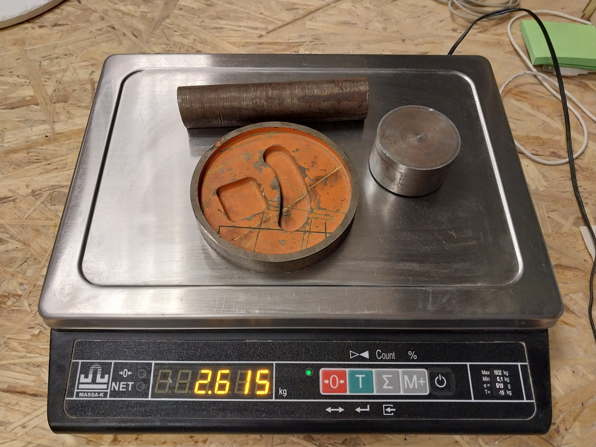

# artcad robot test

[Инструкция ](https://drive.google.com/file/d/1U5eLFzV6H8NR3o3LD1IKxW2EKsxH2cex/view?usp=sharing)

[BOM](https://docs.google.com/spreadsheets/d/125n-HQTKvdkcZM3G1kUShieqFLzIgVuq7u4Gp4bA2KU/edit?usp=sharing)

Робот и пульт управления:

Робот (вид сверху):

Пульт управления (вид сверху):

Масса робота:

Робот с нагрузкой:

Робот и нагрузка:

Масса нагрузки:

Движение по горизонтальной поверхности с перегрузкой:

https://github.com/m112521/artcad/assets/85460283/55c60170-c797-462b-ba0b-98f8488edfcf

Движение по горизонтальной поверхности с предельной нагрузкой:

https://github.com/m112521/artcad/assets/85460283/2eabe62e-8616-49c1-b112-683721394c89

Прохождение зефира:

https://github.com/m112521/artcad/assets/85460283/a5ff38d2-dbe4-409b-b31a-4a8745c51eb8

Подъем на мост без нагрузки:

https://github.com/m112521/artcad/assets/85460283/8976cd7c-c456-4580-8c3a-efa5c510ec77

Подъем на мост с нагрузкой:

https://github.com/m112521/artcad/assets/85460283/569532c0-12af-46c1-a7ed-e49c4eb4b4a3
